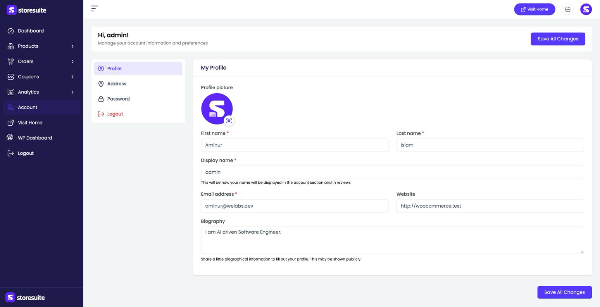
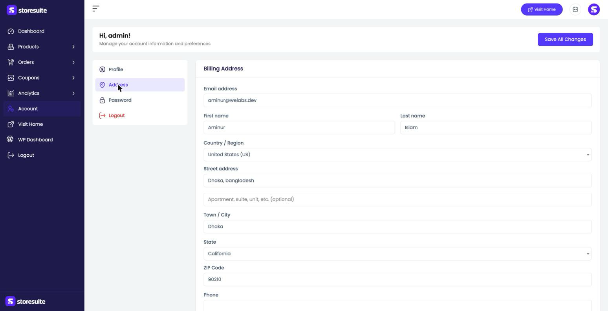
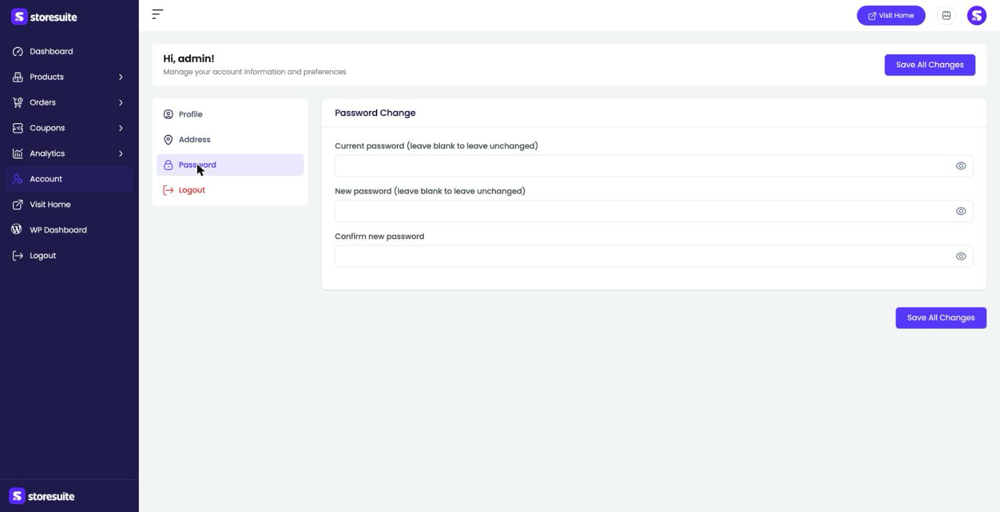

# Your Account in StoreSuite

The **Account** section is your personal corner of the dashboard — your name and profile, your address, and your password. It's where you (or any team member) manage your own details without going anywhere near the WordPress admin.

To get there, click **Account** in the left sidebar. The page greets you by name (*"Hi, admin!"*) and organizes everything into tabs down the left: **Profile**, **Address**, **Password**, and **Logout**.

> A **Save All Changes** button sits at both the top-right and bottom-right of the page. It saves everything across the tabs at once, so you can update your profile and address together and save just once.

---

## Profile

The **Profile** tab holds how you appear across the store:

- **Profile picture** — click the small camera icon to upload or change your avatar.
- **First name** *(required)* and **Last name** *(required)*.
- **Display name** *(required)* — how your name shows in the account area and on reviews.
- **Email address** *(required)* — your contact email.
- **Website** — an optional link to your own site.
- **Biography** — a short bio; depending on your theme, this may be shown publicly.

---

## Address

The **Address** tab holds your **Billing Address** — the details used on orders and receipts:

- **Email address**
- **First name** and **Last name**
- **Country / Region**
- **Street address** (with an optional second line for apartment, suite, etc.)
- **Town / City**
- **State**
- **ZIP Code**
- **Phone**

Fill in whatever applies and save.

---

## Password

The **Password** tab is where you change your login password:

- **Current password** — your existing password (leave blank to keep your password unchanged).
- **New password** — the password you'd like to switch to.
- **Confirm new password** — type it again to make sure it matches.

Each field has a small eye icon so you can reveal what you've typed and double-check it. Leave these blank and nothing about your password changes.

> **Tip:** Only fill in the password fields when you actually want to change your password. Because **Save All Changes** saves the whole page, leaving them blank keeps your current password exactly as it is.

---

## Logout

The **Logout** tab signs you out of the dashboard. (You'll also find **Logout** at the very bottom of the main sidebar.)

---

## A Few Friendly Tips

- **Set a real display name.** It's what customers see on reviews — "Aminur from Support" reads better than a username.
- **Keep your email current.** Order notifications and password resets go there, so an out-of-date address can leave you locked out.
