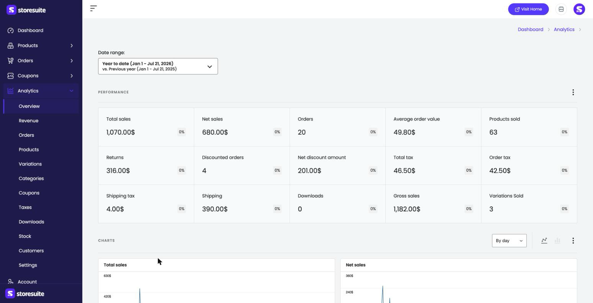
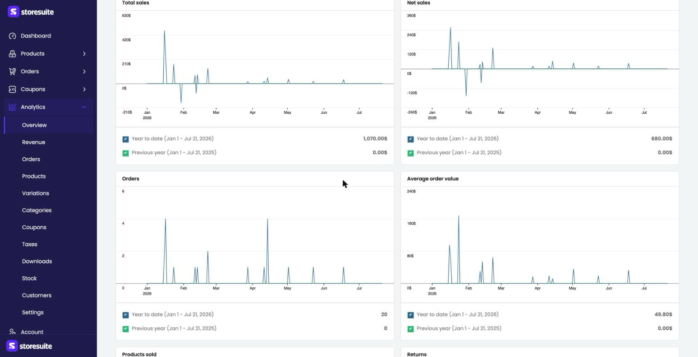
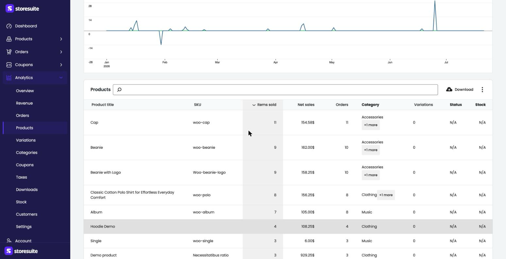

# Analytics & Reports in StoreSuite

Where the dashboard home gives you the quick pulse of your store, the **Analytics** section is where you dig in. It's a full reporting suite — sales, orders, products, taxes, customers, stock and more — each with its own comparison, chart, and detailed table you can search and download.

To get there, click **Analytics** in the left sidebar. It opens on the **Overview** report, and the sub-menu lists every report: **Overview**, **Revenue**, **Orders**, **Products**, **Variations**, **Categories**, **Coupons**, **Taxes**, **Downloads**, **Stock**, **Customers**, and **Settings**.

---

## Choosing Your Time Window

Every report starts with a **Date range** picker (and most add a comparison, like *vs. Previous year*). Click it to choose a preset — **Today**, **Week to date**, **Month to date**, **Year to date**, and so on — or switch to the **Custom** tab for your own dates. Pick whether to compare against the **Previous period** or the **Previous year**, then click **Update**. Every number, chart, and badge on the report refreshes to match.

> **Tip:** If a report shows all zeros, check the date range first — "Month to date" early in the month simply may not have data yet. Switch to "Year to date" to see the bigger picture.

---

## The Overview Report

**Overview** is the bird's-eye view. The **Performance** grid packs in every headline number at once — each card showing the value for your date range plus a percentage badge comparing it to the previous period:

- **Total sales**, **Net sales**, **Gross sales**
- **Orders**, **Average order value**, **Products sold**, **Variations sold**
- **Returns**, **Discounted orders**, **Net discount amount**
- **Total tax**, **Order tax**, **Shipping tax**, **Shipping**
- **Downloads**

### The charts

Below the numbers, a grid of charts plots each metric over time — Total sales, Net sales, Orders, Average order value, and more. Every chart overlays your selected period against the comparison period, so you can literally see this year's line pulling ahead of (or behind) last year's.

Two controls sit above the charts: a **By day** dropdown to change the time grouping, and icons to switch between **line** and **bar** views.

---

## The Detailed Reports

Each report in the sub-menu focuses on one area, and they all share the same friendly layout: a couple of summary stat cards at the top, a chart, and a searchable table of the details.

Here's the **Products** report as an example. At the top, **Items sold**, **Net sales**, and **Orders** summarize the range. Below the chart sits the leaderboard — every product with its **SKU**, **Items sold**, **Net sales**, **Orders**, **Category**, **Variations**, **Status**, and **Stock**. Click a column header (like **Items sold**) to sort by it, and use the search box to find a specific product.

What each report focuses on:

| Report | What it answers |
|--------|-----------------|
| **Revenue** | Your money over time — gross sales, returns, discounts, tax, shipping, net sales |
| **Orders** | Order counts and values, broken down by status and date |
| **Products** | Which products sell best — items sold, revenue, and orders per product |
| **Variations** | The same, but down to each variation (size, color) of a variable product |
| **Categories** | Which categories drive the most sales |
| **Coupons** | Which discount codes actually get used, and what they cost you |
| **Taxes** | Tax collected, broken down by rate |
| **Downloads** | Activity for downloadable products |
| **Stock** | Current stock levels — a fast way to spot what's running low |
| **Customers** | Who your customers are and what they spend |

### Downloading a report

Most report tables have a **Download** button that exports the data as a CSV file — perfect for your accountant, a spreadsheet, or a deeper look outside StoreSuite.

---

## Analytics Settings

The **Settings** item at the bottom of the Analytics menu controls how reports behave — things like the default date range and how certain figures are calculated — so the reports match the way you actually think about your store.

---

## A Few Friendly Tips

- **Start on Overview, then drill down.** Spot something odd in the headline numbers, then open the matching report to find out why.
- **Sort the leaderboards.** Click **Net sales** to see your top earners, or **Items sold** to see what moves in volume — two very different lists.
- **Export for the accountant.** The **Taxes** and **Revenue** reports plus the **Download** button save you a lot of month-end spreadsheet work.
