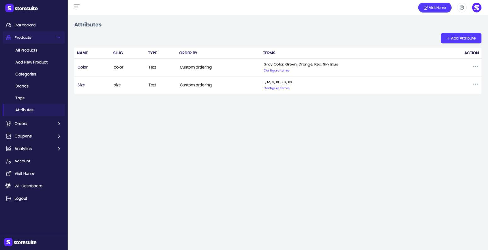
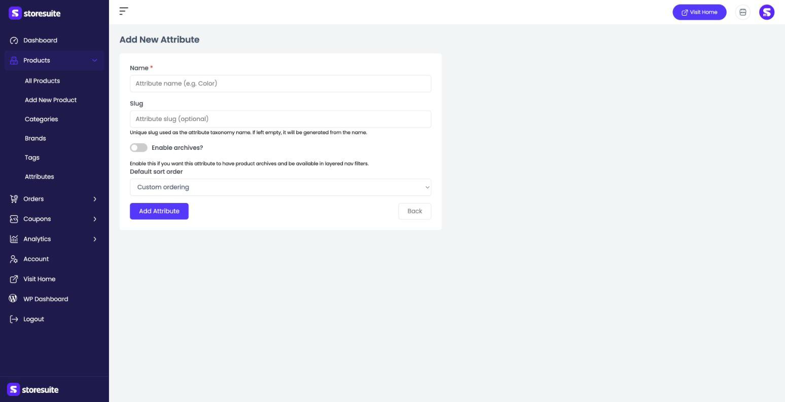
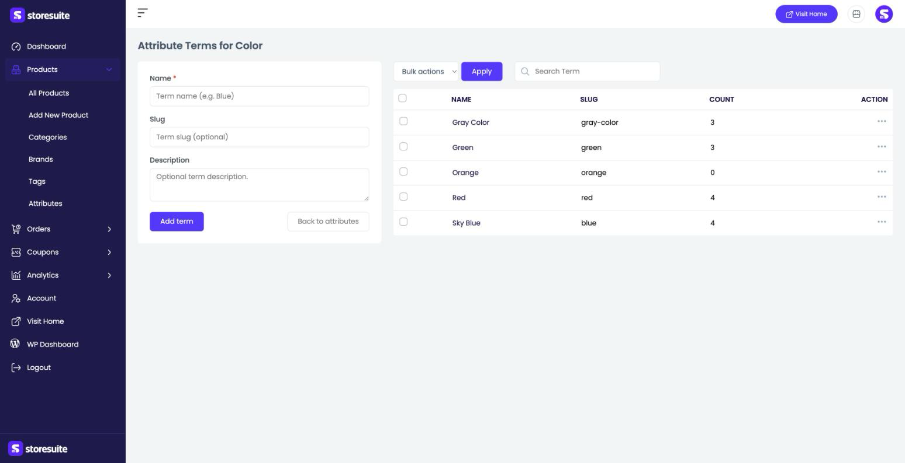

# Product Attributes in StoreSuite

Attributes describe the characteristics of your products — **Color**, **Size**, **Material**, and so on. They do two jobs: they power the options on a **Variable** product (so one product can come in Small/Medium/Large), and they can drive filters that help shoppers narrow down what they're looking for.

Each attribute has a set of **terms** — the actual values. The **Color** attribute might have the terms Red, Green, and Sky Blue; the **Size** attribute might have S, M, L, XL.

To manage them, open **Products → Attributes** in the left sidebar.

---

## The Attributes List

Each attribute you've created is listed here.

| Column | What it tells you |
|--------|-------------------|
| **Name** | The attribute's name, like "Color" |
| **Slug** | The URL-friendly version used behind the scenes |
| **Type** | How values are entered (for example, plain **Text**) |
| **Order by** | How its terms are sorted by default |
| **Terms** | A preview of the values, with a **Configure terms** link to manage them |
| **Action** | The **⋯** menu to edit or delete the attribute |

---

## Adding a New Attribute

Click **+ Add Attribute** at the top right:

- **Name** *(required)* — the attribute's name, like "Color."
- **Slug** — optional; leave it blank and it's generated from the name.
- **Enable archives?** — turn this on if you want the attribute to have its own product pages and be available in layered navigation filters.
- **Default sort order** — how terms are ordered by default (custom ordering, name, or number).

Click **Add Attribute** to save, or **Back** to return without saving.

---

## Managing an Attribute's Terms

Click **Configure terms** next to an attribute (here, **Color**) to manage its values. The page has two halves:

- **On the left**, a small form to add a new term: **Name** *(required)*, an optional **Slug**, and an optional **Description**. Click **Add term** to save it, or **Back to attributes** to return.
- **On the right**, the list of existing terms, each showing its **Name**, **Slug**, and a **Count** of how many products use it. Search with the **Search Term** box, use the **⋯** menu to edit or delete a term, or select several and use **Bulk actions → Apply**.

---

## Putting Attributes to Work

Once your attributes and terms exist, you use them on the product form:

1. Open a product and scroll to the **Attributes** section.
2. Pick an attribute (like Color) and click **Add Attribute**, then choose which terms apply to this product.
3. To sell variations, set the product **Type** to **Variable** — the attribute terms become the options customers pick from, each with its own price and stock.

> **Tip:** Set up your attributes and terms *before* building variable products. With Color and Size already defined, creating a variable product becomes a matter of ticking the right values instead of typing them out every time.
