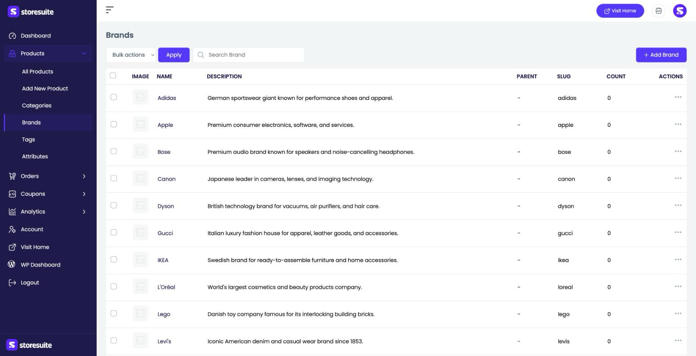
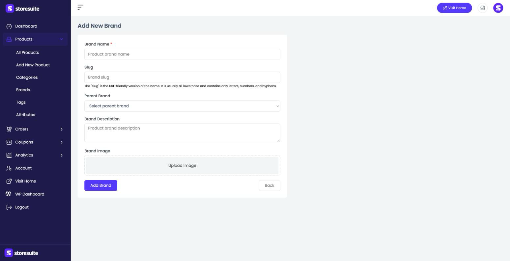

# Managing Brands in StoreSuite

Brands let you group products by their maker or label — Adidas, Apple, IKEA — so shoppers can browse "everything by this brand." If you sell across many labels, brands make your store far easier to shop.

To manage them, open **Products → Brands** in the left sidebar.

---

## The Brands List

Every brand you've created appears here.

| Column | What it tells you |
|--------|-------------------|
| **Image** | The brand's logo or thumbnail, if set |
| **Name** | The brand's name |
| **Description** | A short description of the brand |
| **Parent** | A parent brand, if this one nests under another (a dash means top-level) |
| **Slug** | The URL-friendly version of the name |
| **Count** | How many products are assigned to this brand |

### Finding and managing brands

- Use the **Search Brand** box to filter by name.
- Click the **⋯** menu at the end of a row to **Edit** or **Delete** a brand.
- Tick the checkboxes and use **Bulk actions → Apply** to act on several brands at once.

---

## Adding a New Brand

Click **+ Add Brand** at the top right and fill in the short form:

- **Brand Name** *(required)* — the label shoppers see, like "Adidas."
- **Slug** — the URL-friendly version. Leave it blank to have one generated from the name.
- **Parent Brand** — nest this brand under another, or leave it top-level.
- **Brand Description** — an optional blurb about the brand.
- **Brand Image** — upload the brand's logo or a representative image.

Click **Add Brand** to save, or **Back** to return without saving.

---

## Editing a Brand

Choose **Edit** from a brand's **⋯** menu to open the same form pre-filled with its details, then save your changes.

---

## Assigning Products to a Brand

You don't set brands from this page — you attach them while editing a product. On the product form, the **General information** panel has a **Brand** selector. As you assign products, the **Count** here climbs to match.

> **Tip:** Add a logo as the **Brand Image**. Many themes show it on the brand's page and next to products, and it makes your store look far more polished.
