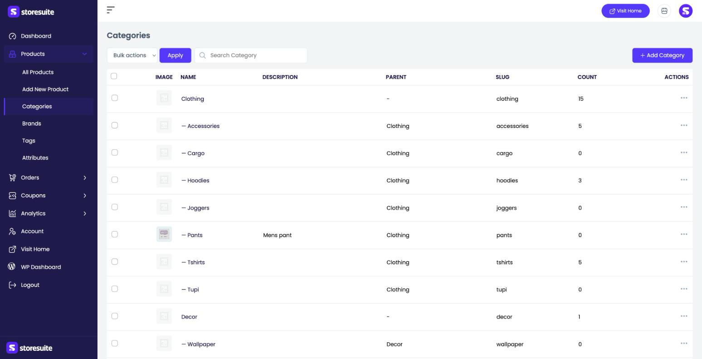
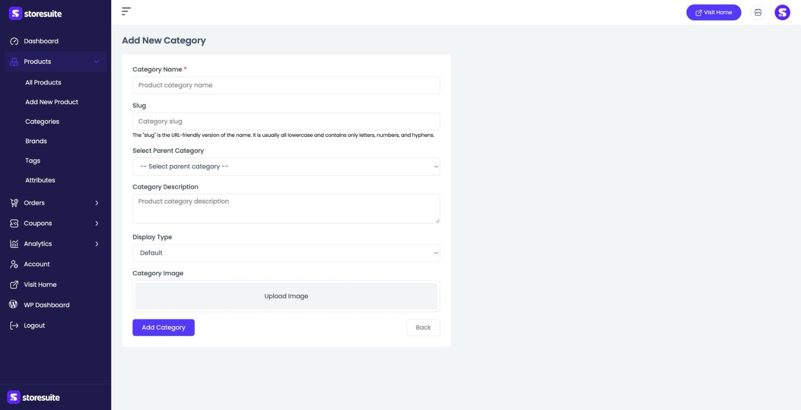

# Organizing Products with Categories in StoreSuite

Categories are how you group your products so shoppers can browse — "Clothing," "Accessories," "Decor," and so on. They can nest, too: a broad **Clothing** category can hold **Hoodies**, **Tshirts**, and **Joggers** underneath it.

To manage them, open **Products → Categories** in the left sidebar.

---

## The Categories List

Every category in your store is listed here, with sub-categories shown indented under their parent (you'll see a dash, like *— Accessories*, to mark the nesting).

| Column | What it tells you |
|--------|-------------------|
| **Image** | The category's thumbnail, if you've set one |
| **Name** | The category's name |
| **Description** | A short description, if added |
| **Parent** | The category it sits under (a dash means it's top-level) |
| **Slug** | The URL-friendly version of the name |
| **Count** | How many products are filed in this category |

### Finding and managing categories

- Use the **Search Category** box to filter the list by name.
- Click the **⋯** menu at the end of a row to **Edit** or **Delete** a category.
- Select rows with the checkboxes and use **Bulk actions → Apply** to act on several at once.

> **Tip:** The **Count** column is a quick health check — a category showing **0** has no products in it yet, so shoppers browsing to it will find an empty page.

---

## Adding a New Category

Click **+ Add Category** at the top right. The form is short and friendly:

- **Category Name** *(required)* — what shoppers see, like "Winter Coats."
- **Slug** — the URL-friendly version of the name. Leave it blank and StoreSuite builds one from the name automatically.
- **Select Parent Category** — choose a parent to nest this category underneath, or leave it top-level.
- **Category Description** — an optional blurb; some themes show this at the top of the category page.
- **Display Type** — how the category page presents itself (Default, products, subcategories, or both).
- **Category Image** — upload a thumbnail to represent the category.

Click **Add Category** to save, or **Back** to return without saving.

---

## Editing a Category

Choose **Edit** from a category's **⋯** menu. It's the same form, pre-filled with the current details — change what you need and save.

---

## A Few Friendly Tips

- **Keep it shallow.** One or two levels of nesting is plenty; deep category trees make products harder to find.
- **Name for shoppers, not for you.** "Gifts under $25" beats an internal code — categories are part of how customers navigate.
