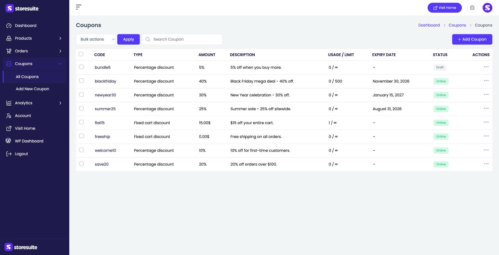
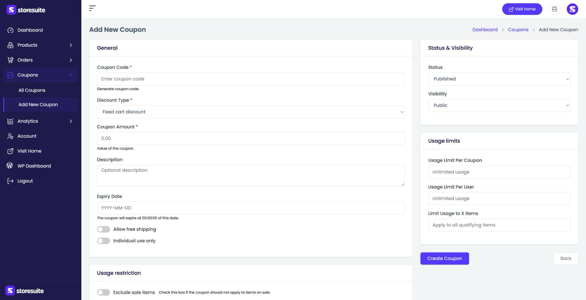
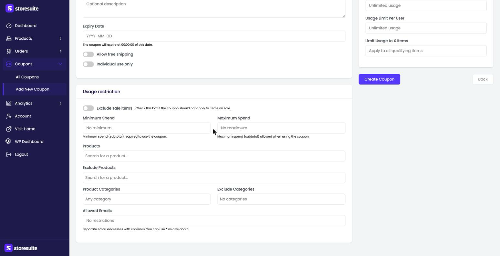

# Creating Coupons in StoreSuite

Coupons are your promotions — percentage-off sales, fixed-dollar discounts, free shipping, first-timer perks. StoreSuite lets you build and manage them all without touching the WordPress admin.

To get there, click **Coupons** in the left sidebar. It opens into **All Coupons**, with **Add New Coupon** just below.

---

## The Coupons List

Every coupon you've created appears here.

| Column | What it tells you |
|--------|-------------------|
| **Code** | The code customers type at checkout (like *summer25*) |
| **Type** | How it discounts — **Percentage discount**, **Fixed cart discount**, or **Fixed product discount** |
| **Amount** | The size of the discount (a percentage or a dollar amount) |
| **Description** | Your own note about what the coupon is for |
| **Usage / Limit** | How many times it's been used versus its cap (∞ means unlimited) |
| **Expiry Date** | When it stops working (a dash means no expiry) |
| **Status** | **Online** (live) or **Draft** (not yet active) |

### Finding and managing coupons

- Use the **Search Coupon** box to find one by code.
- Click the **⋯** menu at the end of a row to **Edit** or **Delete** a coupon.
- Tick the checkboxes and use **Bulk actions → Apply** to act on several at once.

---

## Adding a New Coupon

Click **+ Add Coupon** at the top right. The form is split into clear sections.

### General

- **Coupon Code** *(required)* — what customers type, like "WELCOME10." The **Generate coupon code** link creates a random one for you.
- **Discount Type** *(required)* — **Fixed cart discount** (a dollar amount off the whole cart), **Percentage discount** (a percentage off), or **Fixed product discount** (a dollar amount off specific products).
- **Coupon Amount** *(required)* — the value: `25` for 25% off, or `15` for $15 off, depending on the type.
- **Description** — an optional internal note.
- **Expiry Date** — the day the coupon stops working. Leave blank for no expiry.
- **Allow free shipping** — toggle on to also grant free shipping.
- **Individual use only** — toggle on to stop this coupon being combined with others.

### Status & Visibility

- **Status** — **Published** to make it live, or a draft for later.
- **Visibility** — whether the coupon is public or private.

### Usage limits

- **Usage Limit Per Coupon** — the total number of times it can be used across all customers.
- **Usage Limit Per User** — how many times a single customer can use it.
- **Limit Usage to X Items** — apply the discount to only a set number of qualifying items.

### Usage restriction

This section decides exactly *when* the coupon is allowed:

- **Exclude sale items** — turn on so the coupon can't stack on already-discounted products.
- **Minimum Spend** / **Maximum Spend** — the cart subtotal range required to use the coupon.
- **Products** / **Exclude Products** — limit the coupon to (or block it from) specific products.
- **Product Categories** / **Exclude Categories** — the same, but by category.
- **Allowed Emails** — restrict the coupon to certain customer emails. Separate addresses with commas; you can use `*` as a wildcard.

When it all looks right, click **Create Coupon** to save. **Back** returns to the list without saving.

---

## Editing a Coupon

Choose **Edit** from a coupon's **⋯** menu to open the same form pre-filled with its current settings — adjust anything and save.

---

## A Few Friendly Tips

- **Set a minimum spend to protect your margins.** "20% off orders over $100" (Percentage discount + Minimum Spend) rewards bigger baskets instead of tiny ones.
- **Use "Individual use only" on your best deals** so a big promo code can't be stacked with other discounts.
- **Draft first, launch later.** Build a Black Friday coupon now, leave it as a **Draft**, and flip it to **Online** when the sale starts.
