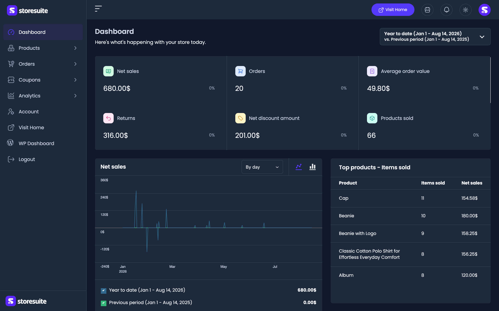
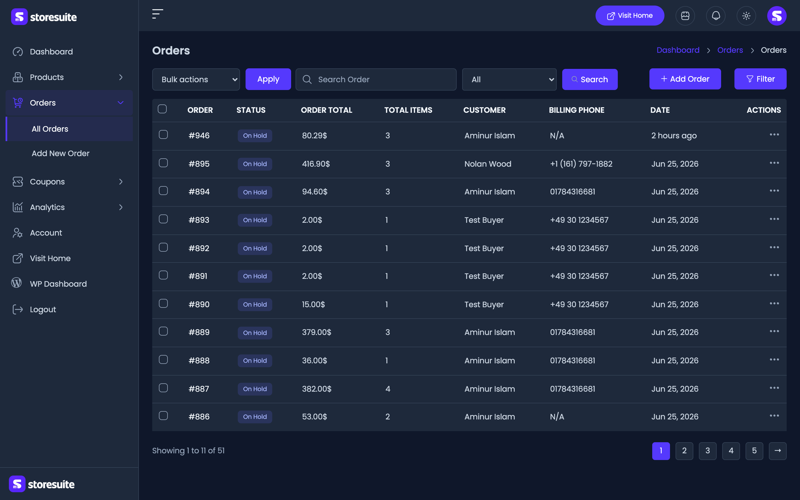
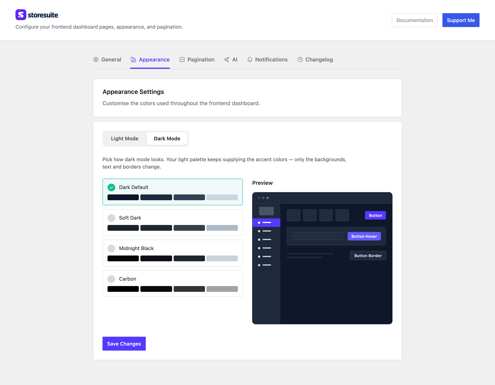

# Dark Mode in StoreSuite

Packing orders late at night, or just prefer a darker screen? The whole StoreSuite dashboard comes in light and dark, and switching takes one click.

---

## The Toggle

Look at the top bar of any dashboard page for the **sun / moon** button. Click it and the entire dashboard flips — sidebar, tables, forms, buttons, charts, everything.

Three things worth knowing:

- **Your choice sticks.** StoreSuite remembers it in your browser, so the dashboard opens the way you left it next time.
- **It's yours alone.** Dark mode is a personal preference, not a store setting. You can work in dark while your shop manager stays in light.
- **Your device gets the first word.** Before you've ever touched the toggle, StoreSuite follows your computer's own light/dark setting. If your Mac or Windows is in dark mode, the dashboard starts dark. Click the toggle once and your choice takes over from then on.

There's no flash of the wrong colors while a page loads — StoreSuite works out the theme before it draws anything.

---

## What's Covered

All of it. Dark mode isn't a coat of paint on the main screens only — it runs through every corner of the dashboard:

- Product, order, coupon, category, tag, and brand lists, including their filters and pagination
- The full product and order forms, quick edit, and the text editor
- Order details, account and address forms
- Dialogs, dropdowns, switches, badges, and buttons
- The complete **Analytics** suite — report charts, KPI tiles, data tables, advanced filters, the date-range picker, and the loading placeholders

---

## Choosing the Dark Look (Admin)

Dark mode isn't one fixed shade. In the WordPress admin, go to **WooCommerce → StoreSuite → Appearance** and switch to the **Dark Mode** tab to pick which one your store uses:

| Palette | The feel |
|---------|----------|
| **Dark Default** | Soft slate blue — easy on the eyes, the safe choice |
| **Soft Dark** | Warmer and lower contrast, gentler for long sessions |
| **Midnight Black** | Near-black with crisp edges |
| **Carbon** | True black — the deepest option, great on OLED screens |

Pick one and the preview updates right away, so you can see it before saving. Click **Save Changes** to apply it.

> **How it relates to your brand colors:** the dark palettes set the *neutrals* — backgrounds, surfaces, text, and borders. Your accent color (buttons, the active sidebar item) carries over from the light palette you chose on the same tab, so your brand stays recognizable in either theme. Choosing a dark palette won't undo your branding.

Whichever you pick applies to everyone who switches their dashboard to dark.

---

## Keeping Your Logo Readable

A logo designed for a light sidebar can vanish against a dark one. That's what the dark variants are for.

Under **WooCommerce → StoreSuite → General**, both **Dashboard sidebar logo** and **Dashboard sidebar icon** have a **Light mode / Dark mode** switch above the image. Flip it to **Dark mode**, upload a light-colored version of your logo, and StoreSuite swaps to it automatically whenever the dashboard is in dark mode — and swaps back the moment someone returns to light.

Leave the dark slot empty and your regular logo is used in both themes. That's fine if your logo already reads well on dark; add the variant if it doesn't.

---

## A Few Friendly Tips

- **Try the palettes with real data on screen.** An orders list full of colored status badges tells you far more about a palette than the preview does.
- **Carbon suits OLED laptops and phones.** True black saves battery on those screens and looks sharper than a dark gray.
- **Test your logo both ways.** Flip the toggle once after uploading a dark variant to make sure both versions look right.
- **If a teammate says the dashboard "looks wrong," check the toggle first.** They may simply have inherited dark mode from their computer's system setting without realizing it.
