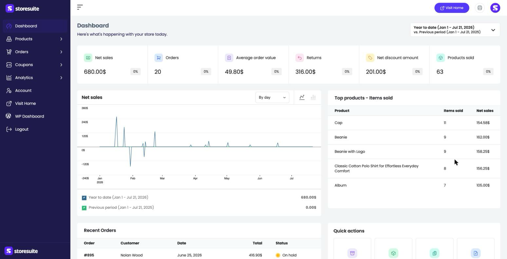
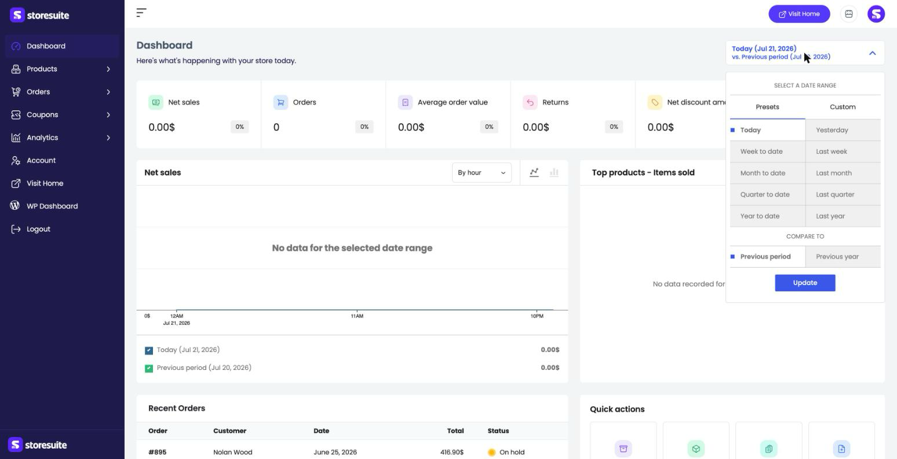
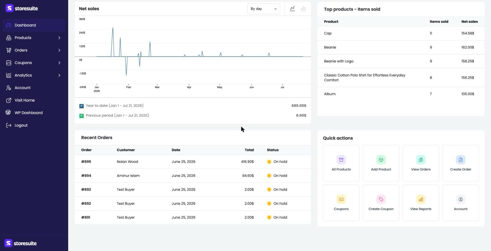

# Your Dashboard at a Glance in StoreSuite

Log in, land on the dashboard, and within a few seconds you know how your store is doing. That's the whole idea.

The **Dashboard** is the first thing you (and your team) see when opening StoreSuite. It greets you with *"Here's what's happening with your store today"* — and then shows you exactly that: your key sales numbers, a trend chart, your best-selling products, your latest orders, and one-click shortcuts to the things you do most.

To get there, click **Dashboard** at the top of the left sidebar.

> **In the top bar, on every page:** a **bell** that badges new orders, customer sign-ups, and reviews as they happen (see [Notifications](../notifications/notifications.md)), and a **sun/moon** button that switches the dashboard between light and dark (see [Dark Mode](../dark-mode/dark-mode.md)).

---

## The Numbers That Matter

Across the top sit six summary cards, each showing a headline number for your chosen time window along with a small percentage badge comparing it to the period before:

| Card | What it tells you |
|------|-------------------|
| **Net sales** | Your sales total after refunds and discounts — the real money that came in |
| **Orders** | How many orders were placed |
| **Average order value** | The typical amount a customer spends per order |
| **Returns** | The value of refunded items |
| **Net discount amount** | How much you gave away in coupons and discounts |
| **Products sold** | The total number of items that left your shelves |

The little percentage badge on each card is the quick story: up or down compared to the previous period. A glance tells you whether today (or this month) is running ahead of or behind where you were.

---

## Pick Your Time Window

Every number on the dashboard answers one question: *"How are we doing — compared to before?"* The date range picker at the top right decides what "now" and "before" mean.

Click it and a panel opens with two tabs:

- **Presets** — the quick choices: **Today**, **Yesterday**, **Week to date**, **Last week**, **Month to date**, **Last month**, **Quarter to date**, **Last quarter**, **Year to date**, and **Last year**.
- **Custom** — pick your own start and end dates for a one-off range.

Underneath, **Compare to** lets you choose what "before" means:

- **Previous period** — the stretch of time immediately before your selected range.
- **Previous year** — the same dates one year ago. Perfect for seasonal stores, where comparing December to November tells you nothing but December-to-last-December tells you everything.

Make your picks and click **Update**. The whole dashboard refreshes to match.

> **Tip:** Running a promotion? Set the range to the promo week and compare with the previous period — the percentage badges instantly tell you whether it moved the needle.

---

## The Net Sales Chart

The large **Net sales** chart plots your revenue over the selected range so you can see the shape of your sales — the steady days, the spikes, the quiet stretches.

Two small controls sit at the top of the chart:

- A **By hour / By day** dropdown that changes how finely the timeline is broken up. Short ranges can go hour by hour; longer ranges read better day by day.
- A pair of icons to switch between a **line** chart and a **bar** chart, whichever you find easier to read.

Below the chart, a small legend shows your selected period and the comparison period side by side, each with its own total.

---

## Top Products — Your Best Sellers

To the right, **Top products – Items sold** ranks the products moving the most units in your selected window. Each row shows the product name, how many **items sold**, and the **net sales** it brought in. It's the fastest way to see what's carrying your store — and what to restock first.

---

## Recent Orders — What Just Happened

The **Recent Orders** table lists your latest orders: order number, customer (or *Guest*), date, total, and a colored **status badge** — yellow for on-hold, green for completed, and so on.

It's the "does anything need my attention?" panel. A glance tells you whether new orders are flowing in and whether any are stuck waiting. For the full picture — and to act on an order — head to **Orders** in the sidebar.

---

## Quick Actions — One Click to Everywhere

The **Quick actions** grid is your launchpad. Instead of hunting through menus, jump straight to:

- **All Products** — your product list
- **Add Product** — start a new product right away
- **View Orders** — the orders list
- **Create Order** — log a phone or in-person sale
- **Coupons** — manage your discount codes
- **Create Coupon** — spin up a new promotion
- **View Reports** — open the full Analytics section for deeper digging
- **Account** — edit your account details

If your day starts with "add the new arrivals" or "check this morning's orders," it now starts with a single click.

---

## A Few Friendly Tips

- **Make the comparison work for you.** The percentage badges only mean something next to the right "before" — match your comparison to the question you're asking.
- **Seasonal store? Compare year-over-year.** December vs. November is misleading; December vs. last December is the truth.
- **Watch Returns alongside Net sales.** Climbing revenue with climbing returns is a very different story from climbing revenue alone.
- **Use the dashboard as a morning ritual.** Set the range to "Today," spend ten seconds scanning, and you'll know whether it's a normal day or one that needs attention — before your coffee gets cold.
