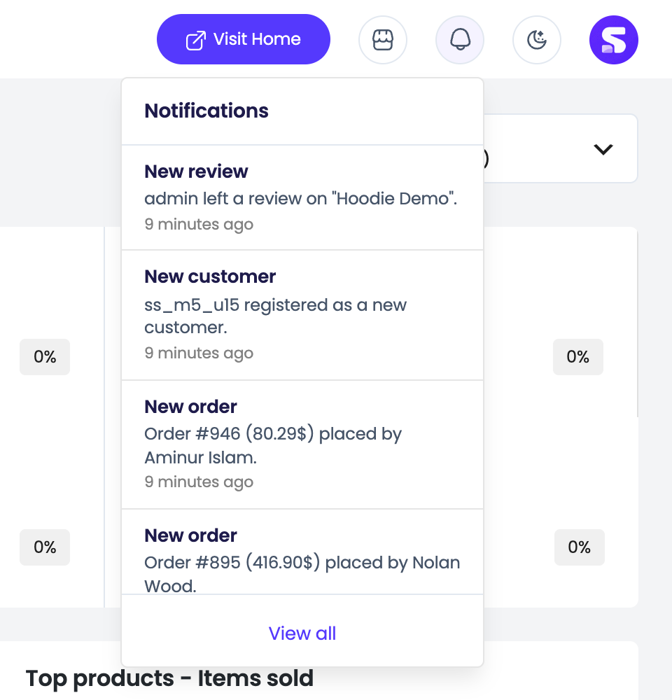
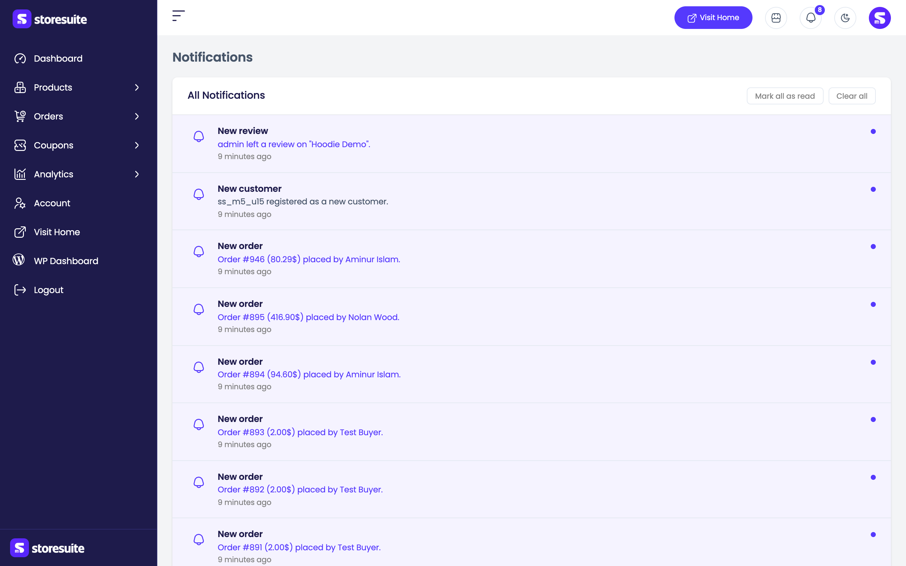
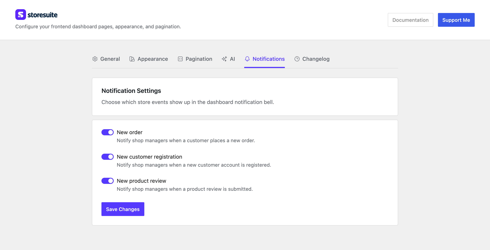

# Notifications in StoreSuite

Something just happened in your store — an order came in, a customer signed up, someone left a review. StoreSuite tells you about it without you having to go looking.

A small **bell** sits in the top bar of every dashboard page. When there's something new, a badge appears on it with a count. New activity arrives on its own while you work, so you don't have to refresh the page to find out.

---

## The Bell and Its Badge

The badge on the bell shows how many unread notifications you have. Once you pass nine it simply reads **9+** — past that, the exact number stops being useful.

Click the bell and a panel drops down with your **five most recent** notifications. Each one shows:

- **What happened** — for example, *New order received*
- **A short detail line** — the order number and total, the customer's name, the product that was reviewed
- **How long ago** it happened — *2 minutes ago*, *3 hours ago*

Click any notification to jump straight to the thing it's about: the order details page, the customer, the product. At the bottom of the panel, **View all** opens the full notifications page.

> Opening the dropdown marks everything in it as read. The badge disappears immediately — no extra click needed.

---

## The Notifications Page

Click **View all** (or **Notifications** in the sidebar) for the complete history under the heading **All Notifications**.

Every notification is listed newest first. Unread ones carry a small dot so you can tell at a glance what you haven't seen yet. Longer lists break into pages, with the usual count at the bottom — *"Showing 1 to 15 of 20"* — and page controls to move through them.

Two buttons sit at the top of the list:

- **Mark all as read** — clears every unread dot and the bell badge in one click. It only appears when you actually have unread notifications.
- **Clear all** — deletes your notification history for good. StoreSuite asks you to confirm first, because this can't be undone.

If you haven't had any activity yet, you'll see a friendly **No notifications yet!** message instead.

---

## What Gets a Notification

Three kinds of events, all switched on by default:

| Event | When it fires |
|-------|---------------|
| **New order** | A customer places an order |
| **New customer registration** | Someone creates an account on your store |
| **New product review** | A customer reviews one of your products |

You decide which of these you want. Go to **WooCommerce → StoreSuite → Notifications** in the WordPress admin and toggle any of them off. Turning one off stops it being recorded from that moment on — it won't quietly pile up unseen in the background.

---

## Who Sees Notifications

Only people who can manage WooCommerce — store owners and shop managers. Customers never see the bell.

**Everyone gets their own copy.** If you and your shop manager are both watching the store, you each have your own list, your own unread count, and your own history. Reading a notification marks it read for you and nobody else, and **Clear all** clears only your list — your manager's stays exactly as it was.

That's usually what you want: two people fulfilling orders shouldn't be hiding new-order alerts from each other by opening them first.

---

## Housekeeping

Notifications older than **90 days** are tidied away automatically once a day, so the list stays useful and your database doesn't collect years of old alerts. There's nothing to configure and nothing to clean up by hand.

---

## A Few Friendly Tips

- **Let the badge be your inbox.** If it's empty, nothing has happened since you last looked — no need to go check the orders list.
- **Turn off what you don't act on.** If you get dozens of reviews a week and never act on them individually, switch **New product review** off and keep the bell meaningful.
- **Click through, don't navigate.** Clicking a notification takes you straight to the order or product — faster than finding it in a list.
- **Don't reach for Clear all as a "mark read" button.** **Mark all as read** clears the badge; **Clear all** throws the history away permanently.
