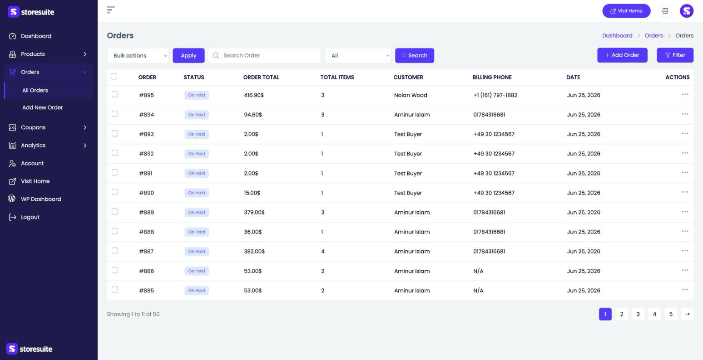
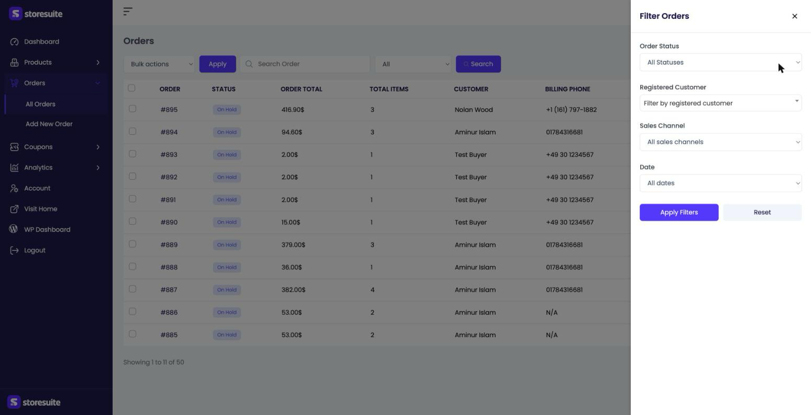
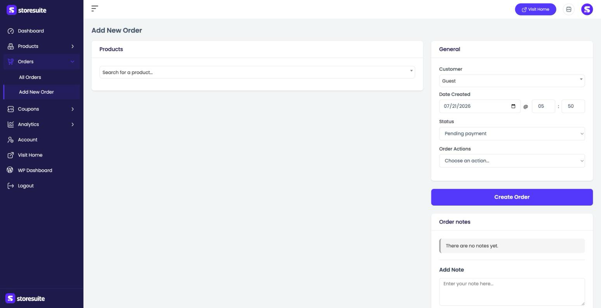
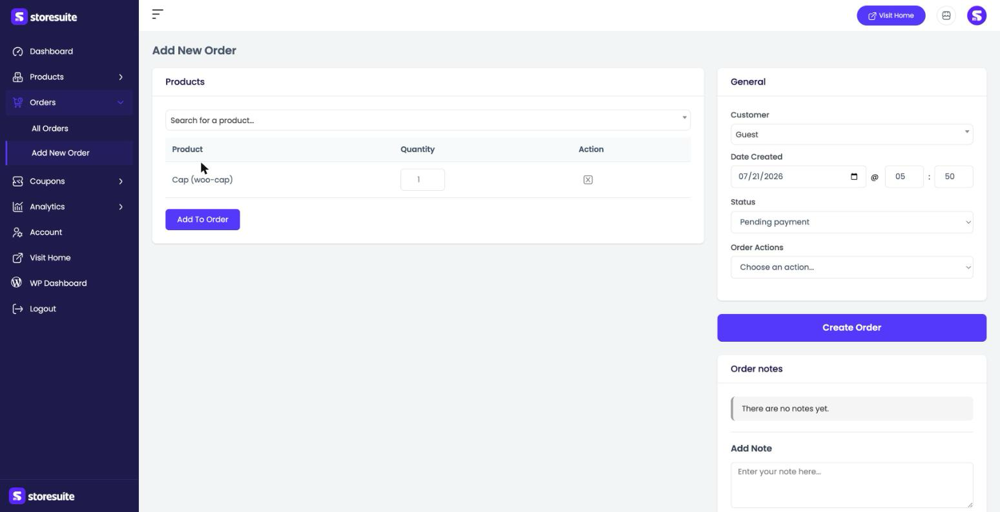
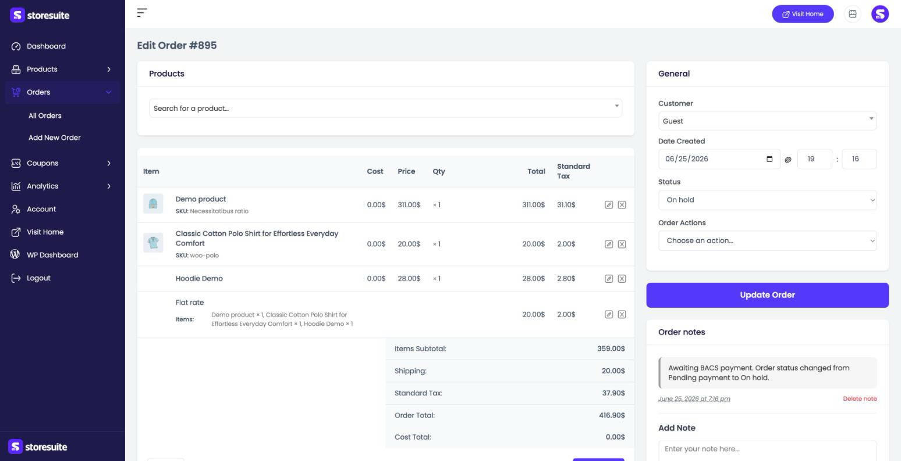

# Managing Orders in StoreSuite

Orders are the heart of your store — every sale lands here. From the **Orders** section you can see what's come in, find a specific order, update its status as you fulfill it, and even create orders by hand for phone or in-person sales.

To get there, click **Orders** in the left sidebar. It opens into **All Orders**, with **Add New Order** just below it.

---

## The Orders List

Every order appears here, newest first.

| Column | What it tells you |
|--------|-------------------|
| **Order** | The order number (like *#895*) |
| **Status** | A colored badge — On Hold, Processing, Completed, and so on |
| **Order Total** | The amount the customer paid |
| **Total Items** | How many items are in the order |
| **Customer** | Who placed it (or *Guest*) |
| **Billing Phone** | The customer's phone, if provided |
| **Date** | When the order was placed |

At the bottom you'll see the total count (for example, *"Showing 1 to 11 of 50"*) and page controls.

### Searching and quick filtering

- Type into the **Search Order** box and click **Search** to find an order by number or customer.
- The dropdown next to the search box (set to **All** by default) lets you quickly limit the list by status.
- The **⋯** menu at the end of each row lets you open or act on that order.
- Select rows with the checkboxes and use **Bulk actions → Apply** to update several orders at once.

---

## Filtering Orders

Click **Filter** at the top right and a panel slides in with more precise controls:

- **Order Status** — show only orders in a specific state.
- **Registered Customer** — narrow to a single customer's orders.
- **Sales Channel** — filter by where the order came from.
- **Date** — limit to a date range.

Click **Apply Filters** to narrow the list, or **Reset** to clear everything.

> **Tip:** Filtering by **Processing** status is the fastest way to see exactly what still needs to be packed and shipped.

---

## Creating an Order by Hand

Taking an order over the phone or logging an in-person sale? Click **+ Add Order** (or **Add New Order** in the sidebar).

**On the left, add the products:**

Use the **Search for a product…** box, pick the product, set its **Quantity**, and click **Add To Order**. Each item you add shows up in a small table where you can adjust the quantity or remove it with the **✕** in the Action column.

**On the right, set the details** in the **General** panel:

- **Customer** — choose a registered customer or leave it as **Guest**.
- **Date Created** — the order's date and time.
- **Status** — where the order starts (for example, *Pending payment*).
- **Order Actions** — extra actions like emailing the customer.

Add anything worth remembering under **Order notes**, then click **Create Order** to save it.

---

## Editing an Order

Open an existing order (from its **⋯** menu or by clicking it) and you get the full picture on one screen.

**The items table** lists every product in the order with its **Cost**, **Price**, **Qty**, **Total**, and **Tax**, plus the shipping method. Small icons on each row let you edit or remove a line. Below it, a running summary shows the **Items Subtotal**, **Shipping**, **Tax**, **Order Total**, and **Cost Total**.

**The General panel** on the right is where you manage the order's life:

- Change the **Status** as you work it — from *On hold* to *Processing* to *Completed*.
- Reassign the **Customer** or adjust the date.
- Use **Order Actions** for follow-ups like resending an email.

**Order notes** keep a running history — StoreSuite adds notes automatically (for example, *"Order status changed from Pending payment to On hold"*), and you can add your own with **Add Note**. Notes are dated so you always have a timeline.

When you've made your changes, click **Update Order** to save.

> **Tip:** Use order notes as your paper trail. A quick note like "Customer asked to delay shipping until Monday" saves you (and your team) from guessing later.

---

## Invoices and Packing Slips

If you use a PDF invoice plugin, its documents show up right here in StoreSuite — no trip to the WordPress admin to print a packing slip.

StoreSuite works with either of these (see the plugin's readme for the current list):

- **PDF Invoices & Packing Slips for WooCommerce** — adds Invoice and Packing Slip
- **WebToffee PDF Invoices, Packing Slips, Delivery Notes & Shipping Labels** — adds Invoice, Packing Slip, Delivery Note, Shipping Label, and Dispatch Label

Install and set up whichever you prefer in the usual way, and make sure the documents you want are enabled in *that* plugin's settings. StoreSuite picks them up automatically — there's nothing to configure on the StoreSuite side, and if you have both active, you'll see both sets.

You'll find the documents in two places:

- **In the orders list** — open any order's **⋯** menu and the document actions sit below **View** and **Edit**.
- **On the order details page** — a **Documents** card gathers them all in one place, just above Order notes.

Each action carries a small icon telling you what it does: a **printer** opens your browser's print dialog straight away, and a **download arrow** saves the PDF to your computer. Printing happens right on the page — you stay on the order, no new tab, no losing your place.

> **Tip:** Fulfilling a batch? Work down the orders list and print each packing slip straight from the **⋯** menu without ever opening the orders themselves.

---

## A Few Friendly Tips

- **Work by status.** Filter to Processing, fulfill those, mark them Completed — a clean, repeatable routine.
- **Guest is fine.** For a quick phone order you don't have to create a customer account; leave it as Guest and enter what you need.
- **Let the notes do the remembering.** Every status change is logged automatically, so you can always see what happened and when.
