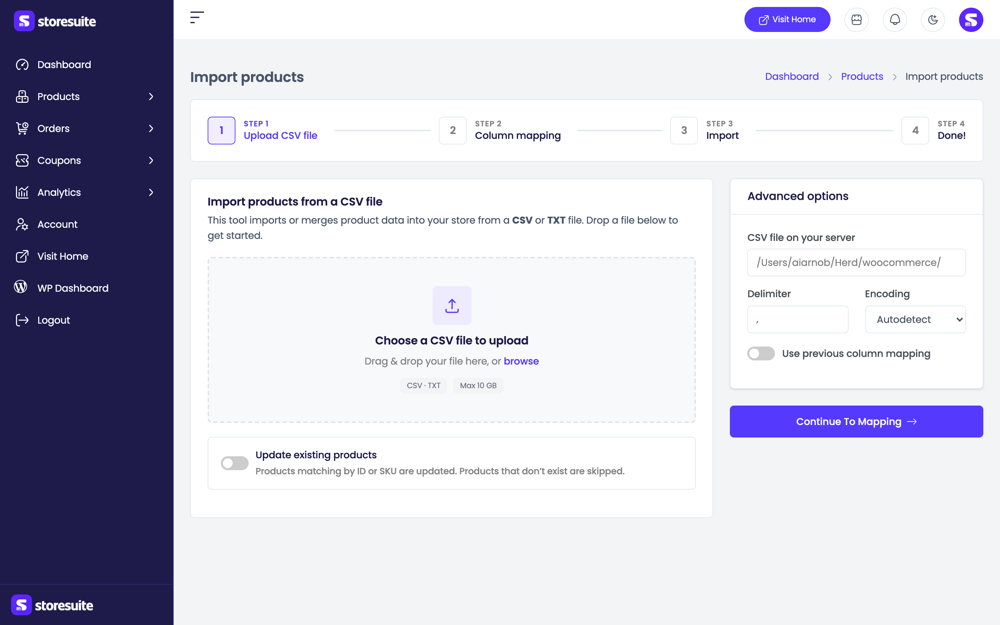
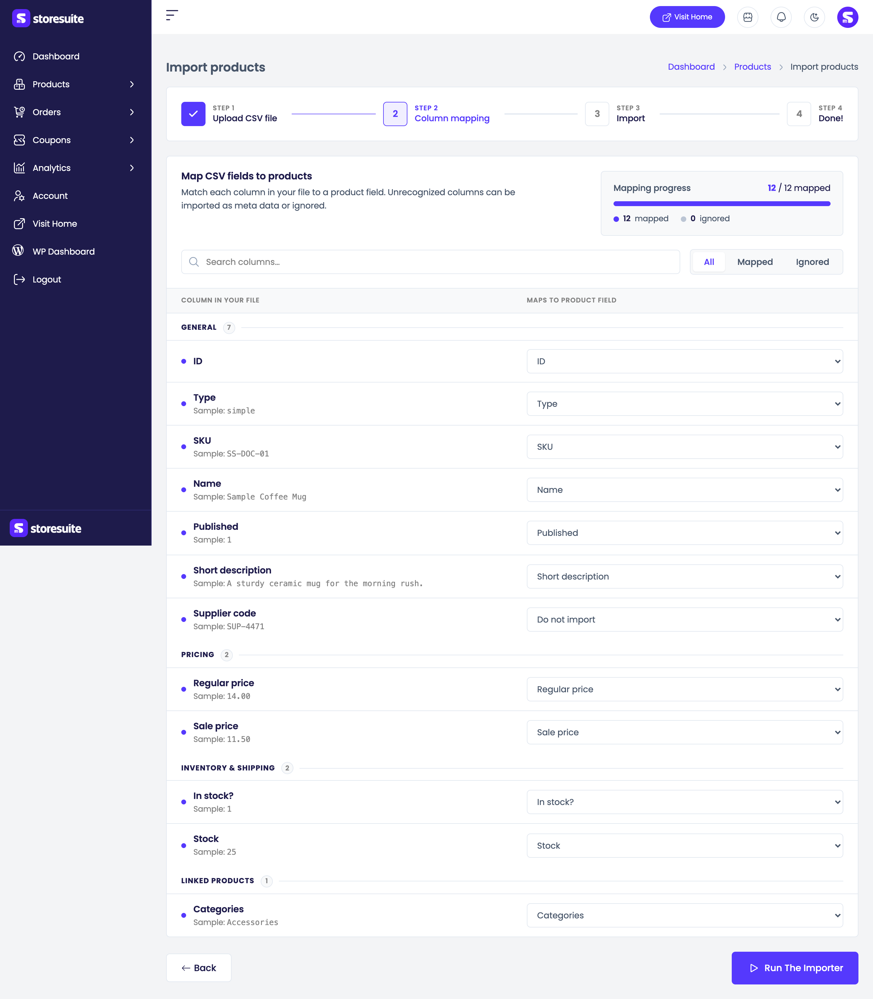
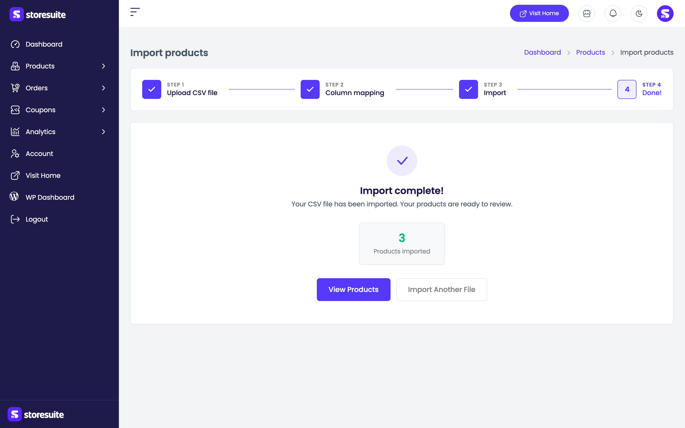

# Importing Products from a CSV

Moving your catalog over from another store? Adding a hundred new items from a supplier spreadsheet? Updating every price at once? You don't have to type any of it in by hand.

StoreSuite's **import wizard** takes a CSV file and turns it into products, walking you through four steps: **Upload CSV file → Column mapping → Import → Done!**. A progress bar across the top shows where you are, with finished steps ticked off.

To start, go to **Products** in the sidebar and click **Import** in the top-right toolbar.

---

## Step 1 — Upload Your File

Drop your CSV onto the upload area, or click **browse** to pick it from your computer. The area tells you which formats are accepted (**CSV · TXT**) and the largest file your server will take (for example, *Max 64 MB*).

### Update existing products

Below the upload box sits one switch worth understanding before you continue:

**Update existing products** — with this on, any row that matches a product you already have (by **ID** or **SKU**) updates that product instead of creating a second one. Leave it off and every row is treated as a brand-new product.

Turn it on when you're refreshing prices or stock for your existing catalog. Leave it off when you're adding products you don't have yet.

> **Tip:** Importing a supplier's price list over your live catalog with this switch off is the classic way to end up with every product duplicated. If your file describes products you already sell, turn it on.

### Advanced options

Most files just work, so this section stays collapsed until you need it:

- **CSV file on your server** — instead of uploading, point the importer at a file already sitting on your server. Handy for files too big to upload through a browser.
- **Delimiter** — the character separating your columns. Commas are assumed; change it if your file uses semicolons or tabs.
- **Encoding** — left on **Autodetect**, StoreSuite works it out. Set it manually if accented characters or symbols come through garbled.
- **Use previous column mapping** — reuse the mapping you set up on an earlier import, so a file in the same format goes straight through without redoing the matching.

Click **Continue to mapping** when you're ready.

---

## Step 2 — Match Your Columns to Product Fields

Every CSV is laid out differently, so this step tells StoreSuite what your columns actually mean.

Under **Map CSV fields to products** you get one row per column in your file:

| What you see | What it means |
|--------------|---------------|
| **Column in your file** | The heading from your CSV — *Name*, *Regular price*, *Stock* |
| **Sample:** | A real value from your file, so you can confirm you're looking at the right column |
| **Maps to product field** | The StoreSuite field it will be imported into — change it with the dropdown |

StoreSuite makes a first guess for every column, and it's usually right for a standard export. Your job is to check its work and fix anything it couldn't recognize.

Columns are grouped so a wide file stays readable: **General**, **Pricing**, **Inventory & shipping**, **Linked products**, **External & downloads**, **Attributes**, **Meta data**, and **Unrecognized columns**.

### Keeping track

A **Mapping progress** bar at the top counts how many columns are **mapped** and how many are **ignored**. The **All / Mapped / Ignored** filters above the table let you show just one group — jumping straight to **Ignored** is the quickest way to find anything that slipped through unmatched. There's also a search box for finding one column in a long file.

### Columns you don't want

Set any column's dropdown to **Do not import** and it's skipped. That's the right answer for internal notes, supplier codes, or anything else that doesn't belong on a product. Nothing forces you to map every column.

When the mapping looks right, click **Run the importer**. **Back** returns you to the upload step.

---

## Step 3 — The Import Runs

You'll see **Importing products** with a progress bar filling up as StoreSuite works through your file in batches.

**Keep this page open until the import finishes** — the wizard says so, and it means it. Closing the tab or navigating away stops the import partway through, leaving some of your rows imported and the rest not.

Big files take a while. It's a good moment to leave it running and go do something else in another tab.

---

## Step 4 — Done

**Import complete!** appears with a summary of what actually happened. You only get a tile for the things that occurred, so a clean import stays uncluttered:

| Tile | Meaning |
|------|---------|
| **Products imported** | New products created |
| **Variations imported** | Variations created for variable products |
| **Products updated** | Existing products changed (only with **Update existing products** on) |
| **Products skipped** | Rows deliberately passed over |
| **Products failed** | Rows that couldn't be imported |

If everything went through cleanly you'll see *"Your products are ready to review."* If some rows had trouble, the message changes to *"some rows need your attention"* and a **View import log** button appears. Open it for a table of every problem row — the **Row** number and the **Reason for failure** — so you can fix those lines in your spreadsheet and import just them again.

From here, **View Products** takes you to your catalog to check the results, and **Import Another File** starts the wizard over.

---

## A Few Friendly Tips

- **Test with five rows first.** Copy a handful of lines into a small CSV and import that. If the mapping is right, the real file will be too — and if it isn't, you've only got five products to clean up.
- **SKUs are what make updates work.** If you plan to update products by import later, make sure every product has a SKU now.
- **Export first, then edit.** The tidiest way to bulk-change prices or stock is to export your products, edit the file, and import it back with **Update existing products** switched on. The columns already match, so mapping takes one glance.
- **Back up before a big import.** Imports change a lot of products at once, and there's no undo button.
