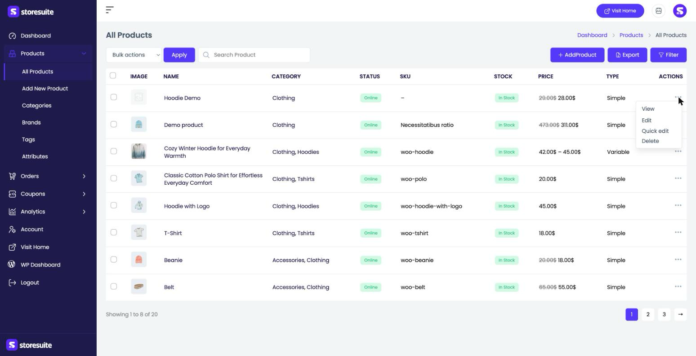
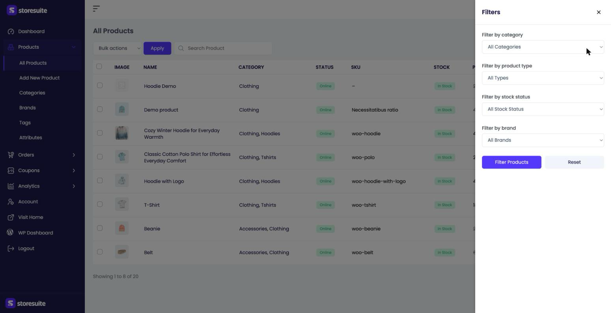
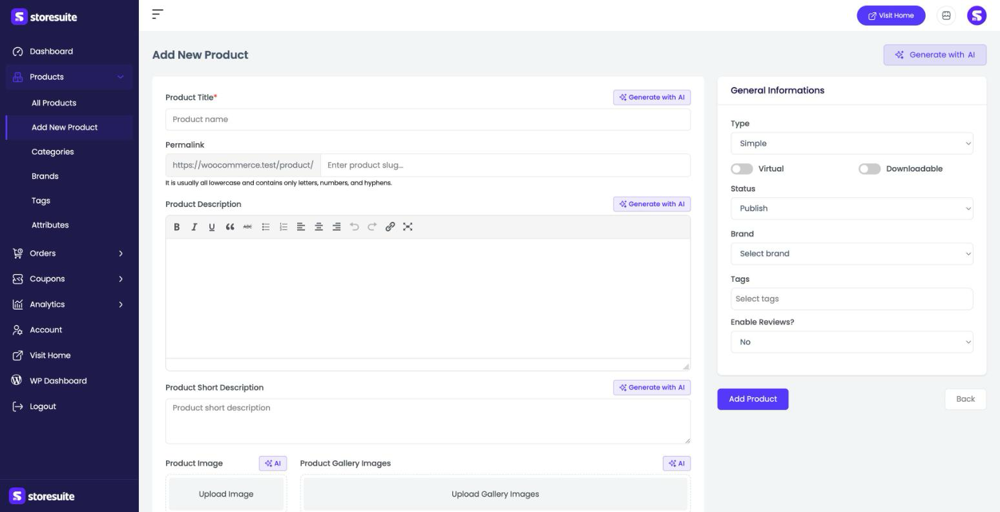
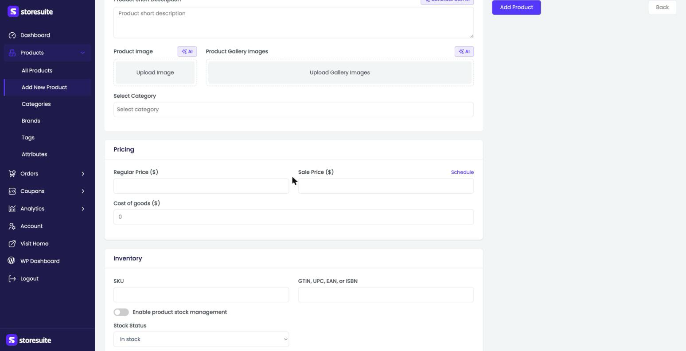
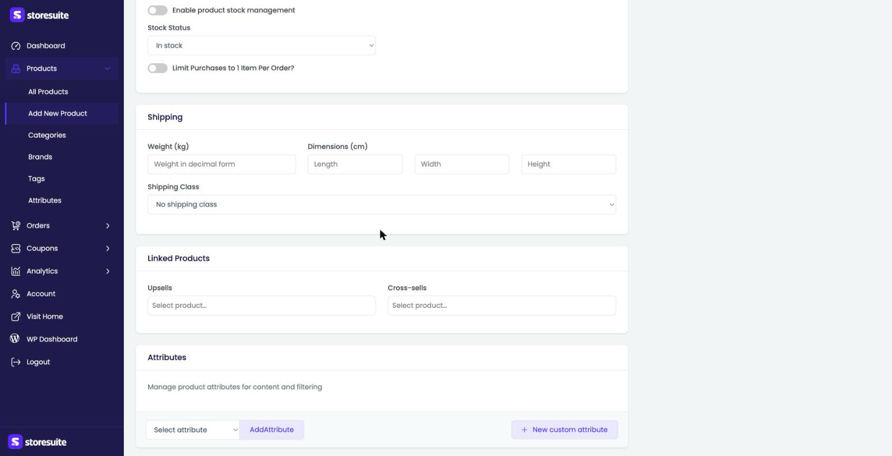

# Managing Products in StoreSuite

Everything you need to sell — adding products, updating prices, tracking stock — lives in the **Products** section of your StoreSuite dashboard. No WordPress admin, no clutter. Just your catalog, in one clean view.

To get there, click **Products** in the left sidebar. It opens into **All Products**, and the sub-menu underneath gives you quick links to **Add New Product**, **Categories**, **Brands**, **Tags**, and **Attributes**.

---

## The Products List

This is your home base. Every product in your store appears here in a simple table, and each row tells you the essentials at a glance:

| Column | What it tells you |
|--------|-------------------|
| **Image** | The product's main photo (a placeholder shows if you haven't added one yet) |
| **Name** | The product title — click it to jump straight into editing |
| **Category** | Which categories the product belongs to |
| **Status** | Whether it's **Online** (live on your store), a draft, or pending review |
| **SKU** | Your stock-keeping unit, if you've set one |
| **Stock** | A colored badge — **In Stock**, **Out of Stock**, or **On Backorder** |
| **Price** | The current price — if the product is on sale, you'll see the old price crossed out next to the new one |
| **Type** | Simple, Variable, and so on |

At the bottom you'll see how many products you have in total (for example, *"Showing 1 to 8 of 20"*) along with page numbers to move through your catalog.

### Finding a product fast

Type a product name into the **Search Product** box at the top and press Enter. The list narrows to matching products right away.

### Quick actions on any product

Click the **⋯** (three dots) at the right end of any row to open a small menu:

- **View** — opens the product page on your live store, so you can see exactly what customers see.
- **Edit** — opens the full editing screen.
- **Quick edit** — change the basics right from the list without leaving the page.
- **Delete** — moves the product to trash.

### Doing things in bulk

Need to update many products at once? Tick the checkboxes on the left of the rows you want, then choose from the **Bulk actions** dropdown above the table:

- **Edit** — change shared details across all selected products in one go.
- **Move to Trash** — remove several products at once.
- **Export** — download the selected products as a file.

Pick your action and click **Apply**. The **Export** button in the top-right corner does the same for your whole list.

### Bringing products in from a file

Next to **Export** you'll find an **Import** button. It opens a step-by-step wizard that turns a CSV file into products — perfect for moving a catalog over from another store, adding a supplier's list, or updating prices in bulk.

It's a guide of its own: see [Importing Products from a CSV](../product-import/product-import.md).

---

## Filtering Your Products

When your catalog grows, scrolling isn't fun anymore. Click the **Filter** button at the top right and a panel slides in from the side with four ways to narrow things down:

- **Filter by category** — show only products from a specific category.
- **Filter by product type** — only Simple products, only Variable, and so on.
- **Filter by stock status** — quickly find everything that's out of stock or on backorder. Great for restock day.
- **Filter by brand** — show products from a single brand.

You can combine filters — for example, *out-of-stock products in the Clothing category*. Once you've made your picks, click **Filter Products**. To go back to seeing everything, hit **Reset**.

> **Tip:** Filters work together with search, so you can search for a name *and* filter by category at the same time.

---

## Adding a New Product

Click **+ Add Product** at the top of the products list (or **Add New Product** in the sidebar). You'll land on a clean form that walks you through everything, top to bottom. Only one field is truly required — the title — so you can start simple and fill in the rest as you go.

### The basics

- **Product Title** *(required)* — the name customers will see.
- **Permalink** — the web address for the product. Leave it blank and it's created automatically from the title.
- **Product Description** — the full story of your product, with a formatting toolbar for bold, lists, links, and more.
- **Product Short Description** — the brief summary that appears near the top of the product page.
- **Product Image** and **Product Gallery Images** — upload the main photo and any extra shots.

> **Tip:** See the **Generate with AI** buttons beside the title, descriptions, and images? StoreSuite can draft your product copy and even create images for you — a real head start when you're adding a lot of products. You control which of these AI buttons appear (and how they write) under **WooCommerce → StoreSuite → AI**.

### General information (right-hand panel)

- **Type** — **Simple** for a single product, or **Variable** if it comes in options like sizes or colors (choosing Variable lets you build variations from your attributes).
- **Virtual** / **Downloadable** — toggle these on for non-physical products, like a service or a file.
- **Status** — **Publish** to go live, or save it as a draft for later.
- **Brand** and **Tags** — file the product under a brand and add tags to help shoppers find it.
- **Enable Reviews?** — decide whether customers can leave reviews.

### Pricing

- **Regular Price** — the normal price.
- **Sale Price** — a lower price for a promotion. **Schedule** lets you set start and end dates so the sale turns on and off by itself.
- **Cost of goods** — what the item costs you, used for profit reporting.

### Inventory

- **SKU** — your internal stock-keeping code.
- **GTIN, UPC, EAN, or ISBN** — a barcode or global product number, if you use one.
- **Enable product stock management** — turn this on to track exact quantities; StoreSuite then counts stock down with each sale.
- **Stock Status** — In stock, out of stock, or on backorder.
- **Limit Purchases to 1 Item Per Order?** — handy for limited or one-per-customer items.

### Shipping, linked products, and attributes

- **Shipping** — **Weight**, **Dimensions** (length, width, height), and a **Shipping Class** for grouping items with similar shipping costs.
- **Linked Products** — set **Upsells** (nicer alternatives shown on the product page) and **Cross-sells** (add-ons suggested at checkout).
- **Attributes** — add characteristics like size or color. Pick an existing attribute and click **Add Attribute**, or build a one-off with **+ New custom attribute**. Attributes are also what power variations on a Variable product.

### Others

At the very bottom, the **Others** box holds the finishing touches: **Catalog Visibility** (where the product shows up), **Menu Order** (its sort position), a **Mark this product as featured** toggle, an **Available for POS** toggle, and a **Purchase Note** shown to the customer after they buy.

When everything looks right, click **Add Product** to save. **Back** returns you to the list without saving.

---

## Editing an Existing Product

Click a product's name in the list, or choose **Edit** from its **⋯** menu. The edit screen is the same form as Add New Product, pre-filled with the product's current details — change what you need and save. For a Variable product, you'll also see a **Variations** area where you manage each combination (size, color, and so on) with its own price and stock.

---

## A Few Friendly Tips

- **Start rough, refine later.** Only the title is required — save a draft and come back to flesh it out.
- **Use Quick edit for price and stock tweaks.** It's the fastest way to bump a price or mark something out of stock without opening the full editor.
- **Let AI do the first draft.** Generate a description, then edit it to sound like you — much faster than a blank page.
