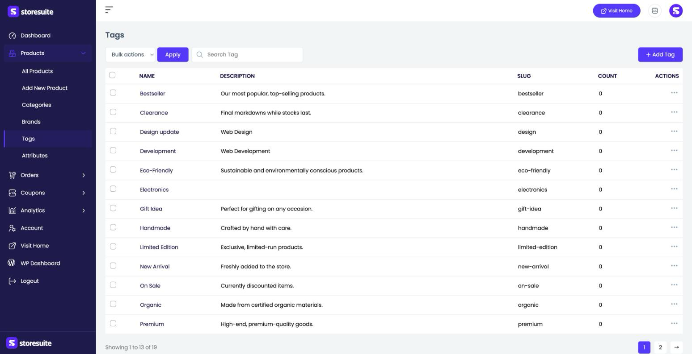
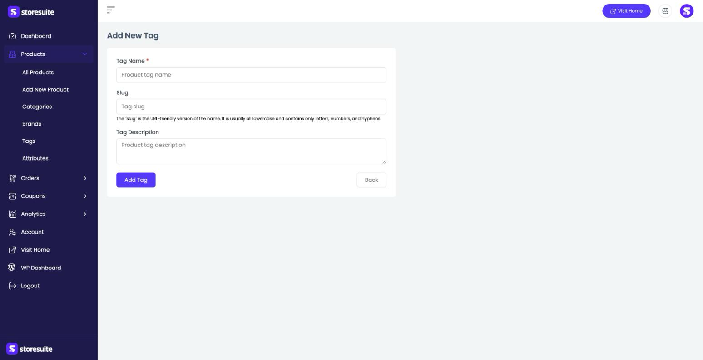

# Tagging Products in StoreSuite

Tags are quick, flexible labels you stick on products to describe them across categories — "Bestseller," "Eco-Friendly," "New Arrival," "On Sale." Where categories are the main structure of your store, tags are the loose keywords that help shoppers (and you) find related items fast.

To manage them, open **Products → Tags** in the left sidebar.

---

## The Tags List

All your tags are listed here, in a flat list — unlike categories and brands, tags don't nest.

| Column | What it tells you |
|--------|-------------------|
| **Name** | The tag's name |
| **Description** | A short description of what the tag means |
| **Slug** | The URL-friendly version of the name |
| **Count** | How many products carry this tag |

### Finding and managing tags

- Use the **Search Tag** box to filter by name.
- Click the **⋯** menu at the end of a row to **Edit** or **Delete** a tag.
- Tick the checkboxes and use **Bulk actions → Apply** to act on several at once.
- If you have many tags, page controls at the bottom let you move through them.

---

## Adding a New Tag

Click **+ Add Tag** at the top right. The form couldn't be simpler:

- **Tag Name** *(required)* — the label, like "Bestseller."
- **Slug** — the URL-friendly version. Leave it blank to have one generated from the name.
- **Tag Description** — an optional note describing the tag.

Click **Add Tag** to save, or **Back** to return without saving.

---

## Editing a Tag

Choose **Edit** from a tag's **⋯** menu to open the same form pre-filled, then save your changes.

---

## Assigning Tags to Products

You attach tags while editing a product — the **General information** panel on the product form has a **Tags** selector where you can add several at once. As you tag products, the **Count** on this page keeps pace.

> **Tip:** Tags are perfect for cross-cutting themes that don't fit your category tree — "Gift Idea," "Handmade," "Limited Edition." Use them to build handy shop pages like "all bestsellers" without reorganizing your categories.
